```mermaid
flowchart TB
    %% =========================
    %% IDENTITY & ACCESS
    %% =========================
    subgraph IDENTITY["Identity &amp; Access"]
        USERS["Clinicians / Staff<br/>EHR &amp; Portal Apps"]
        ENTRA["Microsoft Entra ID<br/>users, groups, CA policies"]
        AGENTID["Entra Agent ID<br/>per-agent identity"]
        AGENT365["Agent 365 (roadmap, May 2026 GA)<br/>tenant-wide agent governance"]
    end

    %% =========================
    %% EDGE & GATEWAY
    %% =========================
    subgraph EDGE["Edge &amp; Gateway"]
        FD["Azure Front Door + WAF<br/>public ingress, DDoS"]
        APIM["Azure API Management<br/>+ GenAI / AI Gateway policies<br/>(optional for single-team scope)"]
        PE["Azure Private Link / PE<br/>private data plane"]
    end

    %% =========================
    %% APP / AGENT HOSTING — FOUR OPTIONS
    %% =========================
    subgraph APP["App / Agent Hosting Tier — pick per workload"]
        direction LR
        AKS["AKS<br/>Kubernetes Service<br/><i>complex multi-service,<br/>BYO operators, GPU</i>"]
        ACA["Azure Container Apps<br/>serverless containers<br/><i>microservices, KEDA scale,<br/>Dapr, jobs</i>"]
        APPSVC["App Service<br/>Web App / API App<br/><i>classic web tier,<br/>fastest path to prod</i>"]
        HOSTED["Foundry Hosted Agents<br/>Agent Service runtime<br/><i>managed orchestration,<br/>no infra to run</i>"]
    end

    %% =========================
    %% AGENT ORCHESTRATION
    %% =========================
    subgraph ORCH["Agent Orchestration — Azure AI Foundry"]
        AGENTSVC["Foundry Agent Service<br/>threads, state, MCP, A2A,<br/>tool calling, hand-off"]
        EVAL["Foundry Evaluations<br/>CI/CD eval pipeline<br/>golden-set regression"]
        TRACE["Foundry Tracing<br/>OpenTelemetry,<br/>per-agent spans"]
        CSAFE["Azure AI Content Safety<br/>prompt shield, jailbreak,<br/>groundedness, PII"]
    end

    %% =========================
    %% MODELS — AZURE DIRECT
    %% =========================
    subgraph MODELS["Models — Azure Direct (Models Sold Directly by Azure, under MS DPA / HIPAA BAA)"]
        direction TB
        subgraph M_MS["Microsoft + OpenAI"]
            AOAI["Azure OpenAI<br/>GPT-5 / 5.1 / 5.2 / mini / nano<br/>o-series successor<br/>text-embedding-3-large"]
            PHI["Microsoft Phi-4 family<br/>Phi-4-reasoning, multimodal<br/><i>cheap / on-device candidate</i>"]
        end
        subgraph M_PARTNER["Partner — first-party hosted on Azure"]
            CLAUDE["Anthropic<br/>Claude Sonnet 4.6<br/>Claude Opus 4.6<br/><i>healthcare-ready Jan 2026</i>"]
            MISTRAL["Mistral AI<br/>Mistral Large 3<br/>Mistral Document AI 25.12<br/><i>doc layout / OCR</i>"]
            GROK["xAI<br/>Grok 4 / Grok 4 Fast<br/><i>non-PHI / judge role only</i>"]
            META["Meta<br/>Llama 3.x / 4"]
            DEEPSEEK["DeepSeek<br/>R1 / V3<br/><i>review for sovereignty</i>"]
            COHERE["Cohere<br/>Command-R+, Embed"]
        end
    end

    %% =========================
    %% AZURE AI SERVICES
    %% =========================
    subgraph AISVC["Azure AI Services — first-party Cognitive Services"]
        direction TB
        TRANS["Azure AI Translator<br/>Document Translation<br/>Custom Translator<br/>2025-10-01-preview hybrid<br/>(NMT + LLM augmentation)"]
        DOCINT["Azure AI Document Intelligence<br/>layout, OCR, tables, forms"]
        LANG["Azure AI Language<br/>Text Analytics for Health<br/>PII detection &amp; redaction<br/>NER, sentiment"]
        SPEECH["Azure AI Speech<br/>STT / TTS<br/><i>not in discharge use case</i>"]
        VISION["Azure AI Vision<br/>OCR, image analysis"]
    end

    %% =========================
    %% DATA, STATE & KNOWLEDGE
    %% =========================
    subgraph DATA["Data, State &amp; Knowledge"]
        SEARCH["Azure AI Search<br/>vector + hybrid index<br/>RAG retrieval"]
        COSMOS["Azure Cosmos DB<br/>agent state, audit trail,<br/>validation records"]
        BLOB["Azure Blob Storage<br/>source/target docs<br/>immutable retention<br/>(HIPAA 7y default)"]
        SQL["Azure SQL / PostgreSQL<br/>relational state, formulary"]
        KV["Azure Key Vault<br/>secrets, keys, certs"]
    end

    %% =========================
    %% OBSERVABILITY & GOVERNANCE
    %% =========================
    subgraph OBS["Observability &amp; Governance"]
        APPINS["Application Insights<br/>Log Analytics<br/>per-request telemetry"]
        DEFENDER["Defender for Cloud<br/>+ Defender for AI<br/>posture, runtime threats"]
        PURVIEW["Microsoft Purview<br/>data classification,<br/>lineage, DLP"]
        POLICY["Azure Policy<br/>landing-zone guardrails"]
    end

    %% =========================
    %% CONNECTIONS — PRODUCTION DATA PATH
    %% =========================
    USERS --> FD
    FD -->|TLS| APIM
    APIM -.optional.-> APP
    FD ==>|direct path<br/>if APIM skipped| APP

    AKS --> AGENTSVC
    ACA --> AGENTSVC
    APPSVC --> AGENTSVC
    HOSTED --> AGENTSVC

    AGENTSVC --> MODELS
    AGENTSVC --> AISVC
    AGENTSVC --> DATA
    AGENTSVC --> CSAFE

    EVAL -.eval.-> MODELS
    EVAL -.eval.-> AISVC

    %% Identity / control plane (dotted)
    ENTRA -.AuthN/AuthZ.-> APP
    ENTRA -.AuthN/AuthZ.-> AGENTSVC
    AGENTID -.identity.-> AGENTSVC
    AGENT365 -.governance roadmap.-> AGENTSVC

    %% Networking
    APP --- PE
    AGENTSVC --- PE
    MODELS --- PE
    AISVC --- PE
    DATA --- PE

    %% Observability flows (dotted)
    APP -.telemetry.-> APPINS
    AGENTSVC -.telemetry.-> APPINS
    TRACE -.spans.-> APPINS
    MODELS -.telemetry.-> APPINS
    DEFENDER -.posture.-> APP
    DEFENDER -.posture.-> AGENTSVC
    PURVIEW -.classify.-> DATA
    POLICY -.guardrails.-> APP

    %% =========================
    %% STYLING
    %% =========================
    classDef identity fill:#e8f0fe,stroke:#1a73e8,color:#0b3b8c
    classDef edge fill:#fff4e5,stroke:#e8710a,color:#8a3e00
    classDef app fill:#e6f4ea,stroke:#137333,color:#0b5223
    classDef orch fill:#f3e8fd,stroke:#7627bb,color:#3d1466
    classDef models fill:#fde7f3,stroke:#c2185b,color:#6a0d33
    classDef aisvc fill:#e0f7fa,stroke:#00838f,color:#003c44
    classDef data fill:#fffde7,stroke:#bfa700,color:#6a5a00
    classDef obs fill:#f1f3f4,stroke:#5f6368,color:#202124

    class USERS,ENTRA,AGENTID,AGENT365 identity
    class FD,APIM,PE edge
    class AKS,ACA,APPSVC,HOSTED app
    class AGENTSVC,EVAL,TRACE,CSAFE orch
    class AOAI,PHI,CLAUDE,MISTRAL,GROK,META,DEEPSEEK,COHERE models
    class TRANS,DOCINT,LANG,SPEECH,VISION aisvc
    class SEARCH,COSMOS,BLOB,SQL,KV data
    class APPINS,DEFENDER,PURVIEW,POLICY obs
```

# Enterprise Agentic AI Architecture — Reference Diagram

**Companion to:** `ask1-architecture-plan.md`
**Audience:** Customer engagement (US healthcare / hospital)
**Posture:** Foundry-led, Azure-direct models, dual-engine translation, US Data Zone for PHI

This is a **logical** reference architecture. The App / Agent Hosting tier shows the four hosting options as alternatives — pick per workload. The Models tier shows the Azure-direct catalog as of May 2026 (all under the Microsoft DPA / HIPAA BAA umbrella). The AI Services tier shows the first-party Cognitive Services relevant to the healthcare workload.

---

## How to read this diagram

- **Solid arrows** = production data path
- **Dashed arrows** = optional / conditional path
- **Dotted arrows** = identity, control plane, or roadmap-only
- The App / Agent Hosting tier presents **four hosting options** — you pick one (or mix) per workload; they are not all required
- The Models tier presents **all Azure-direct model families** — pick a portfolio per role (translator, judge, reasoner, embeddings) per ask1 §3a

---

---

## App / Agent Hosting tier — decision matrix

| Option | When to pick | When to avoid | Notes |
|---|---|---|---|
| **AKS** | Complex multi-service systems, BYO operators/CRDs, fine-grained GPU scheduling, existing K8s muscle on staff | Single-team, no K8s ops capacity, simple agent app | Highest operational cost; highest flexibility |
| **Azure Container Apps (ACA)** | Microservices, event-driven workloads, KEDA scale-to-zero, Dapr sidecars, jobs/cron | Need full K8s API, complex network/service-mesh requirements | Default container-host recommendation for most agentic workloads |
| **App Service** | Classic web/API tier, existing .NET / Java / Node stack, fastest time-to-prod | Need scale-to-zero, container-native event-driven, sidecars | Easiest day-1; least cloud-native day-N |
| **Foundry Hosted Agents** | Pure agent workflows, no custom hosting code, want managed runtime + state + threads | Need to host non-agent application logic next to the agent | Lowest operational footprint; tightest coupling to Foundry |

**HoK posture for this customer:** Start with Foundry Hosted Agents for the agent orchestrator + ACA for any custom Python scorers from ask3. AKS only if their platform team already runs production K8s. App Service if they need a customer-facing web UI quickly.

---

## Models tier — Azure-direct catalog (May 2026)

All families shown are **Models Sold Directly by Azure** — covered automatically under the Microsoft Products and Services DPA, including the HIPAA BAA for EA/MCA/CSP customers. Marketplace SaaS models are intentionally **not** shown.

Per-role recommendation (refs ask1 §3a, ask2 §2):

| Role | Recommended | Alternates | Notes |
|---|---|---|---|
| Primary translator | Claude Sonnet 4.6 **or** GPT-5.1 | Mistral Large 3 | Pick per language on bake-off |
| Cross-check translator (NMT) | Azure Translator (`2025-10-01-preview`) | Translator classical NMT | Custom Translator slot attached |
| Document layout / OCR | Mistral Document AI 25.12 | Document Intelligence | Layout-aware ingestion |
| Reasoning escalation | GPT-5.2 | GPT-5.1 | Replaces retiring o-series |
| LLM-as-judge | GPT-5.1 (must differ from translator family) | Grok 4 Fast (non-PHI only) | Engine independence rule |
| Bulk / nano paths | GPT-5-nano | Phi-4 | Sub-cent per call |
| Embeddings | text-embedding-3-large | Cohere Embed | RAG + back-translation cosine |

---

## What this diagram does NOT show

- **Subscription / landing-zone topology** (hub-spoke VNet, separate subs for prod/non-prod, etc.) — that's a separate landing-zone diagram, recommend Azure Landing Zone for AI accelerator
- **CI/CD pipeline** (GitHub Actions / Azure DevOps → Bicep → Foundry deployment) — separate ALM diagram
- **Specific agent topology** for the discharge workflow — see ask2 §6 (Agents 1–5) and ask3 §3
- **Data-flow per use case** — the diagram is component-level; per-use-case sequence diagrams are a separate artifact (let me know if you want one for the discharge workflow)
- **Disaster recovery / multi-region** — that's a paired diagram for any region-pair design (US East 2 ↔ US West 3 typical)

---

## Open questions on this diagram

1. **APIM or no APIM** — drawn as optional dashed. ask1 §3 recommends skipping for single-team scope and adding only if multi-team / multi-tenant / strong charge-back requirements emerge.
2. **Front Door vs. App Gateway** — drawn as Front Door (global). For single-region deployment App Gateway is fine; for multi-region or external partner integration, Front Door wins.
3. **Agent 365 placement** — drawn dotted because it's roadmap (May 2026 GA, $15/user/mo on E7 Frontier). Architecture does not depend on it today.
4. **Mermaid renderer** — this file renders in GitHub, VS Code (Mermaid Preview extension), Azure DevOps Wiki, and the Mermaid Live Editor (`mermaid.live`). For customer-facing slides, export to SVG/PNG via the Live Editor.

---

**Next iteration ideas if you want a v2:**
- Add a Translation Workflow sequence diagram (per ask2 §6 agents)
- Add a Validation Harness component diagram (per ask3 §3)
- Add a network/landing-zone diagram with hub-spoke and private endpoints
- Add a "what's deployed Day 1 of HoK vs. Phase 2" overlay
